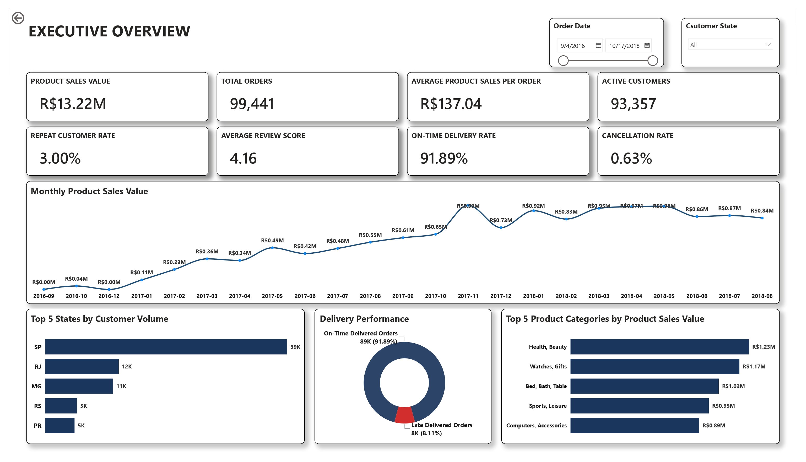
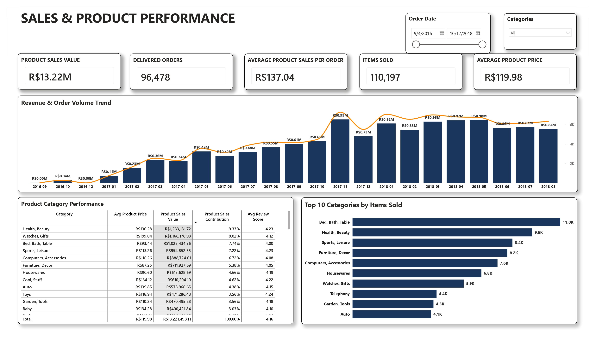
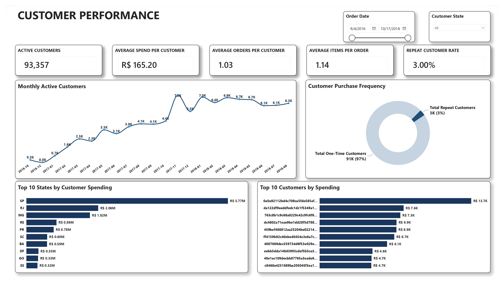
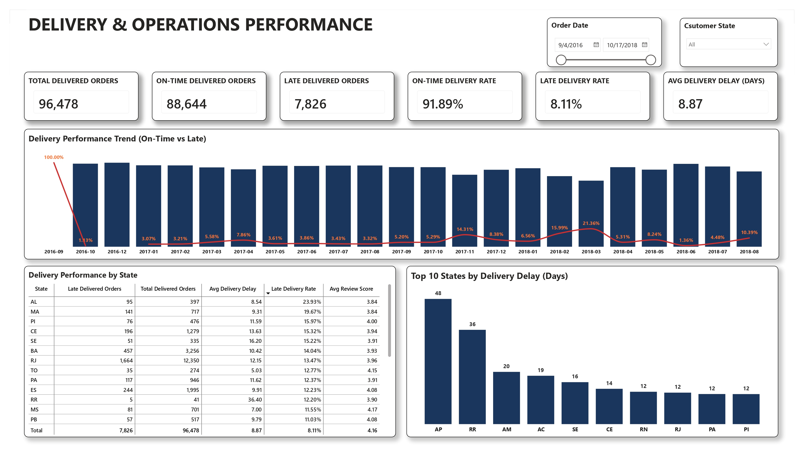
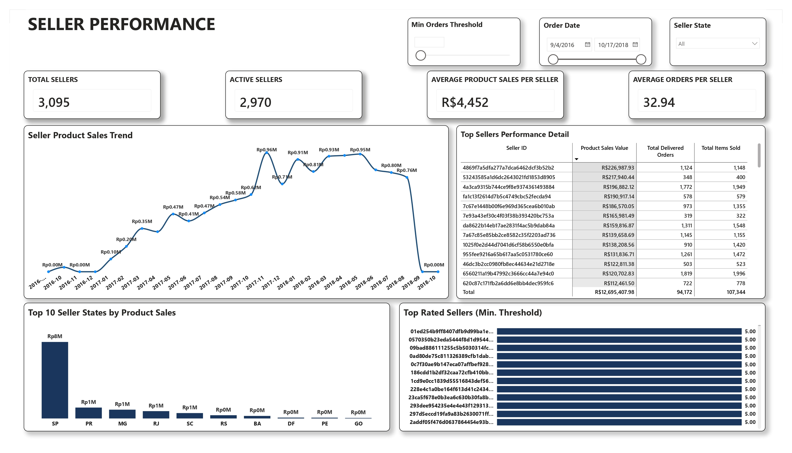
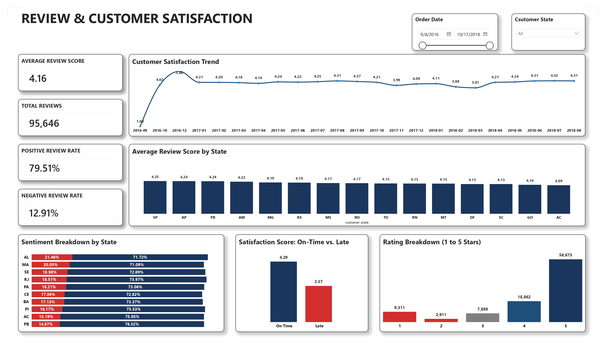

# Olist E-Commerce Analytics

Project business intelligence dan data analytics yang menganalisis data transaksi e-commerce Brazil menggunakan SQL dan Microsoft Power BI.

## Project Overview

Project ini menganalisis Product Sales, customer behavior, delivery performance, seller contribution, dan customer satisfaction untuk mengevaluasi marketplace performance.

Data divalidasi dan dibersihkan menggunakan SQL, kemudian dimodelkan dan dianalisis menggunakan Microsoft Power BI melalui DAX measures dan interactive visualizations.

## Business Problem

Olist membutuhkan insight mengenai performa marketplace untuk memahami:

- Bagaimana Product Sales berkembang dari waktu ke waktu?
- Produk dan kategori mana yang memberikan kontribusi terbesar?
- Bagaimana customer dan seller performance?
- Seberapa efektif delivery performance?
- Bagaimana customer satisfaction bervariasi berdasarkan state dan delivery performance?

## Objectives

- Menganalisis Product Sales dan product category performance.
- Mengevaluasi customer contribution dan purchasing behavior.
- Menilai delivery dan operational performance.
- Mengevaluasi seller activity dan Product Sales contribution.
- Menganalisis customer reviews dan customer satisfaction.
- Mengidentifikasi area yang memerlukan business investigation lebih lanjut.

## Dataset

**Olist Brazilian E-Commerce Dataset** — relational e-commerce dataset yang berisi data customers, orders, order items, payments, reviews, products, sellers, dan geographic data.

## Tools & Technologies

- **MySQL** — data validation, data quality checks, data cleaning, dan analytical queries.
- **Microsoft Power BI** — data modeling, DAX measures, interactive visualizations, dan dashboard development.
- **Microsoft Excel** — supporting data inspection dan validation.

## Analytical Workflow

**Source Data → SQL Validation & Cleaning → Power BI Data Modeling → DAX Analysis → Dashboard Development → Business Insights**

## Dashboard

Dashboard terdiri dari enam halaman analisis:

1. **Executive Overview** — overall business performance.
2. **Sales & Product** — sales dan product performance.
3. **Customer Performance** — customer contribution dan behavior.
4. **Delivery & Operations** — delivery dan operational performance.
5. **Seller Performance** — seller activity dan contribution.
6. **Review & Customer Satisfaction** — customer feedback dan satisfaction.

### 1. Executive Overview



### 2. Sales & Product



### 3. Customer Performance



### 4. Delivery & Operations



### 5. Seller Performance



### 6. Review & Customer Satisfaction



## Key Insights

- Product Sales menunjukkan konsentrasi kontribusi pada sebagian product categories dan seller.
- Delivery performance menunjukkan mayoritas delivered orders berada pada status On-Time, namun Late deliveries tetap menjadi area yang perlu diperhatikan.
- Customer purchasing behavior menunjukkan adanya perbedaan kontribusi dan aktivitas antar customer.
- Customer satisfaction menunjukkan variasi berdasarkan customer state dan delivery performance.
- Seller performance menunjukkan perbedaan tingkat activity dan Product Sales contribution antar seller.

## Business Recommendations

- Menginvestigasi area dengan tingkat Late delivery yang relatif tinggi.
- Mengidentifikasi seller dengan Product Sales tinggi yang juga memiliki delivery performance dan customer satisfaction yang kuat.
- Menginvestigasi product categories dengan Product Sales tinggi tetapi customer feedback yang relatif lebih rendah.
- Mengeksplorasi customer states dengan perbedaan customer satisfaction yang signifikan.

## Project Files

```text
olist-ecommerce-analytics/
├── README.md
├── dashboard/
│   └── Power BI dashboard
├── documentation/
│   └── Project Documentation
├── screenshots/
│   └── Dashboard screenshots
└── sql/
    ├── 01_import_validation.sql
    ├── 02_data_quality_check.sql
    └── 03_data_cleaning.sql
